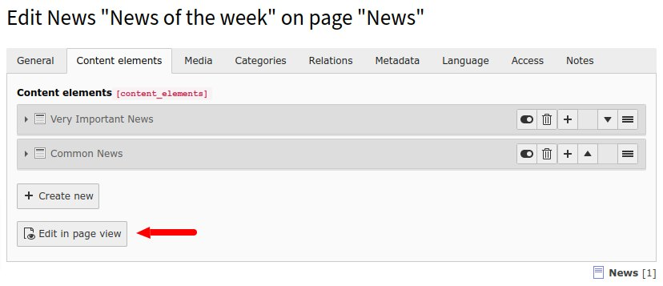
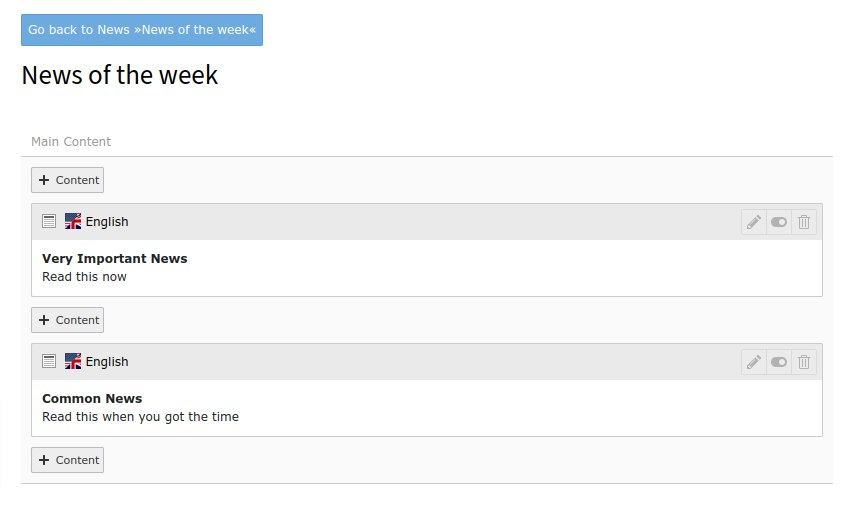

# Inline Page Module for TYPO3

This is a TYPO3 extension that provides a page-module view for inline 
tt_content records of non-page records, like news.

## Installation

Use composer to add the package as a dependency

```shell
composer require supseven/inline-page-module
```

Requires TYPO3 v10.4-10.5 in composer mode.

## Configuration

### Default

> **Important**: EXT:inline_page_module does not come with defaults, like for 
> news. All fields that should have a page view must be defined by an 
> integrator.

To add the function to a table, use the method 
`\Supseven\InlinePageModule\PageModuleSwitcher::register` in a 
`TCA/Overrides/table.php` file to generate the needed TCA settings. The 
function needs the name of the table as first parameter.

```php
// Add to news table
\Supseven\InlinePageModule\PageModuleSwitcher::register('tx_news_domain_model_news');
```

### With a backend layout

The second parameter can a be the name of a backend layout. The 
page module will then use this backend layout. This is useful if the backend 
layout should have a different column name or if the `colPos` value of the 
tt_content records differs from the inherited layout.

eg. with a PageTS like this

```
mod.web_layout.BackendLayouts.News {
    title = News Elements
    config.backend_layout {
        colCount = 1
        rowCount = 1
        rows.1.columns.1 {
            name = News Content
            colPos = 0
        }
    }
}
```

This backend layout can be used with

```php
// Add to news table with backend layout "News"
\Supseven\InlinePageModule\PageModuleSwitcher::register(
    'tx_news_domain_model_news',
    'News'
);
```

All configurations for backend layouts remain unchanged, which includes 
[`EXT:content_defender`](https://github.com/IchHabRecht/content_defender) 
restrictions.

> **Important**: Having referenced records from multiple fields in several 
> "colPos" in the same page layout view is currently not supported. Each field 
> has its own view.

### Restricting fields

If a table has several fields with inline relations to tt_content records, 
the page module switch is added to all of them. To restrict this to only one 
or several fields, add the names of those fields to the parameter `$fields` 
of the method:

```php
// Add to news table, but only to own field
\Supseven\InlinePageModule\PageModuleSwitcher::register(
    'tx_news_domain_model_news',
    fields: ['tx_my_tt_content_field']
);
```

## Usage

After following the example above, news records will have a "Edit in page 
view" button (red arrow):



Clicking this button will open the page module with the referenced 
tt_content records:



In this view, all the common editing options, like drag-and-drop sorting or 
the "new" and "delete" buttons work like in the page module.

The "Go back..." button is a link to the form of the parent record.

In this view, the page-module navigation point on the left of the TYPO3 
backend is not activated. Also, the page on which the parent record is, is
(still) the selected. 

## Legal

### License

This package is provided under the GPL v3 license. See the file 
[LICENSE](./LICENSE) or <https://www.gnu.org/licenses/gpl-3.0> for details.

### Notices

TYPO3 is provided under the GPL license, v2 or later. See 
<https://typo3.org/project/licenses> for details.

The "News" packaged mentioned in this document refers to 
[extension news](https://github.com/georgringer/news/) provided under the 
GPL v2 or later

The extension icon is part of the the 
[ionicons icon pack](https://ionic.io/ionicons) which is provided under the 
MIT license.
